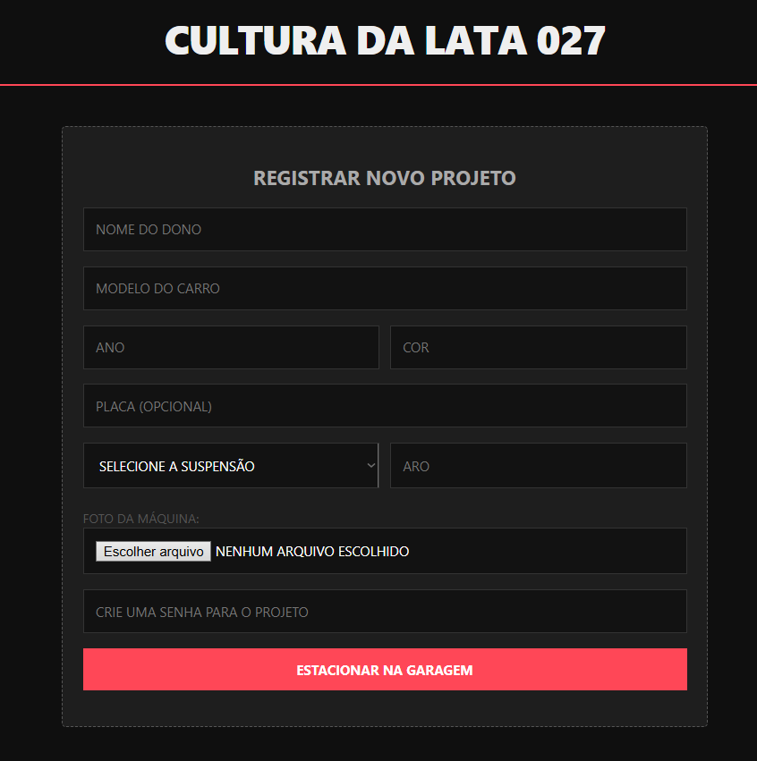
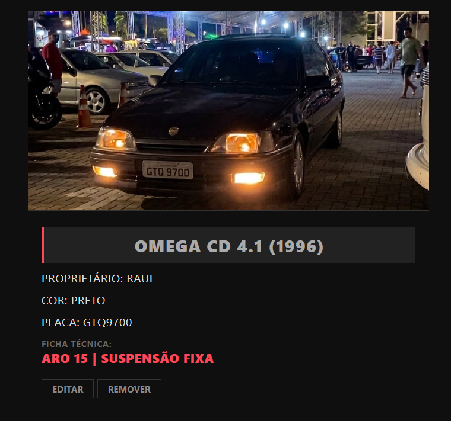
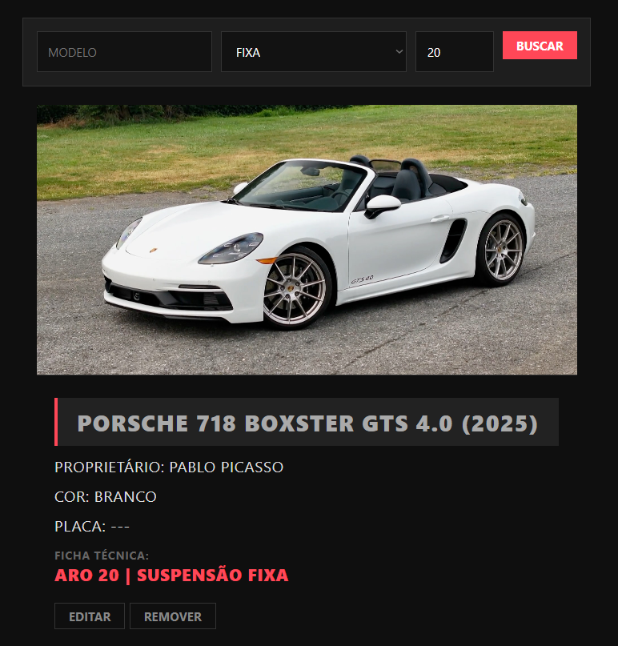
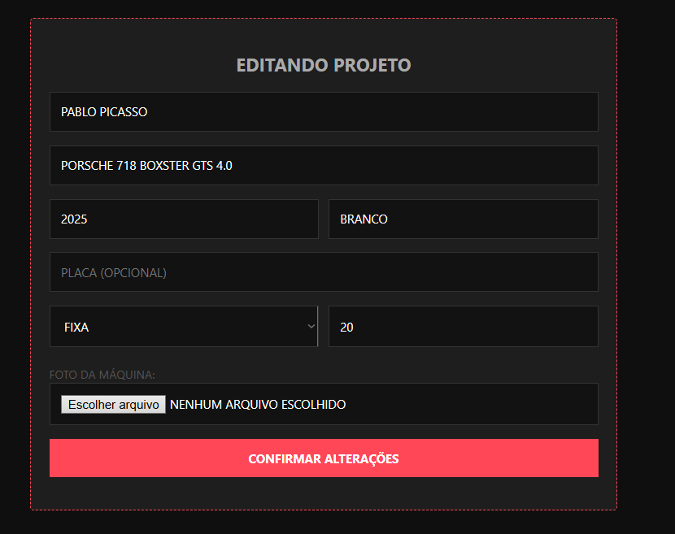
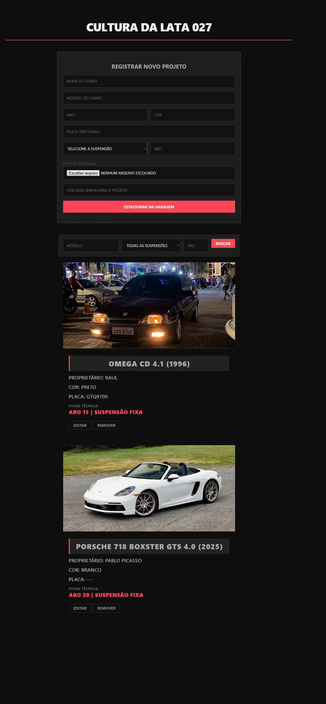

# Garagem Digital - Cultura da Lata 027 🚘

Uma aplicação web Full Stack criada para catalogar, documentar e exibir projetos automotivos da cena de rua — antigos, rebaixados, modificados e projetos em andamento.

O projeto nasceu com a proposta de criar uma "garagem digital" fora dos algoritmos das redes sociais tradicionais, valorizando a identidade de cada carro, sua ficha técnica e a cultura automotiva local.

A interface utiliza uma estética escura, minimalista e low profile, inspirada em revistas automotivas modernas, dando destaque absoluto às máquinas e suas configurações reais.

---

## 🛠️ Tecnologias Utilizadas

- **Back-end:** Python + Flask
- **Banco de Dados:** MySQL / MariaDB
- **Front-end:** HTML5, CSS3 e JavaScript Vanilla
- **Segurança:** Hash de senha com Werkzeug
- **Upload:** Validação de imagem e nomes únicos com UUID
- **Configuração:** Variáveis de ambiente com python-dotenv
- **Controle de Versão:** Git / GitHub

---

## ⚙️ Funcionalidades

- [x] **Catálogo Dinâmico:** listagem de veículos consumindo API REST.
- [x] **Cadastro de Projetos:** criação de novos veículos com ficha técnica.
- [x] **Edição Protegida:** alteração de dados somente mediante senha definida no cadastro.
- [x] **Exclusão Protegida:** remoção de projetos também protegida por senha.
- [x] **Hash de Senha:** senhas não são salvas em texto puro no banco.
- [x] **Upload de Imagens:** envio de fotos via formulário.
- [x] **Validação de Upload:** aceita apenas PNG, JPG, JPEG e WEBP.
- [x] **Nome Único para Imagens:** evita sobrescrita de arquivos com UUID.
- [x] **Limite de Upload:** arquivos limitados a 5 MB.
- [x] **Filtros de Busca:** busca por modelo, tipo de suspensão e aro.
- [x] **Mensagem de Lista Vazia:** feedback visual quando não há projetos encontrados.
- [x] **Modo de Edição:** interface muda visualmente ao editar um projeto.
- [x] **SQL Limpo:** script de banco sem dados pessoais ou sensíveis.

---

## 📸 Interface e Demonstração

### Registro de Projetos



*Formulário de cadastro com ficha técnica, upload de imagem e senha de proteção do projeto.*

### Visualização de Cards



*Cards automotivos com imagem, proprietário, modelo, ano, cor, placa e ficha técnica.*

### Sistema de Filtros



*Busca por modelo, tipo de suspensão e aro.*

### Edição Protegida



*Modo de edição protegido por senha, com alteração visual no formulário.*

### Visão Geral



*Visão completa da aplicação integrando cadastro, filtros e galeria.*

---

## 🔐 Melhorias de Segurança

O projeto foi evoluído para aplicar boas práticas básicas de segurança:

- credenciais do banco removidas do código-fonte;
- uso de arquivo `.env` para configuração local;
- `.env` ignorado pelo Git;
- `.env.example` disponível como modelo;
- senhas armazenadas com hash;
- validação de formato de imagem no front-end e no back-end;
- limite de tamanho para upload;
- geração de nomes únicos para imagens;
- remoção de dados pessoais do script SQL.

---

## 🗄️ Banco de Dados

O projeto utiliza MySQL/MariaDB.

O arquivo `garagem_digital.sql` cria automaticamente:

- o banco `garagem_digital`;
- a tabela `carros`;
- os campos principais da ficha técnica;
- campos de data `criado_em` e `atualizado_em`;
- um dado fictício de demonstração.

> Observação: o dado inicial é apenas demonstrativo. Para testar edição e exclusão corretamente, recomenda-se cadastrar novos veículos pela aplicação, pois as senhas são geradas com hash no momento do cadastro.

---

## 🚀 Como rodar o projeto na sua máquina

### 1. Clone este repositório

```bash
git clone https://github.com/raullferreiraa/garagem-digital.git
```

### 2. Acesse a pasta do projeto

```bash
cd garagem-digital
```

### 3. Instale as dependências

```bash
pip install -r requirements.txt
```

### 4. Configure as variáveis de ambiente

Crie um arquivo `.env` na raiz do projeto com base no `.env.example`.

Exemplo:

```env
DB_HOST=localhost
DB_USER=root
DB_PASSWORD=
DB_NAME=garagem_digital

DEBUG=True
```

### 5. Configure o banco de dados

Importe o arquivo:

```txt
garagem_digital.sql
```

Você pode importar pelo phpMyAdmin ou pelo terminal do MySQL.

### 6. Inicie o servidor Flask

```bash
python app.py
```

O servidor será iniciado em:

```txt
http://127.0.0.1:5000
```

### 7. Acesse a aplicação

Abra o arquivo `index.html` diretamente no navegador.

---

## 📁 Estrutura do Projeto

```txt
garagem-digital/
├── app.py
├── index.html
├── garagem_digital.sql
├── requirements.txt
├── .env.example
├── .gitignore
├── screenshots/
└── uploads/
```

> A pasta `uploads/` é criada automaticamente durante a execução do projeto e não é versionada no GitHub.

---

## 🧭 Roadmap

Próximas evoluções planejadas:

- [ ] Adicionar campo de descrição/história do projeto.
- [ ] Criar visualização detalhada de cada carro.
- [ ] Adicionar categorias como Antigo, Rebaixado, Turbo, Daily e Projeto em andamento.
- [ ] Adicionar ordenação por mais recentes, ano, aro e modelo.
- [ ] Separar CSS e JavaScript em arquivos próprios.
- [ ] Melhorar responsividade mobile.
- [ ] Criar deploy online.
- [ ] Atualizar prints e gravar demonstração do sistema.

---

## 🎯 Aprendizados

Durante o desenvolvimento, foram praticados conceitos como:

- criação de API REST com Flask;
- integração entre front-end, back-end e banco de dados;
- manipulação de formulários com `FormData`;
- upload e armazenamento de arquivos;
- consultas SQL com filtros dinâmicos;
- proteção de operações com senha;
- uso de hash para armazenamento seguro;
- configuração de ambiente com `.env`;
- organização de projeto para GitHub e portfólio.

---

## 👨‍💻 Autor

Projeto desenvolvido por **Raul Ferreira** como parte dos estudos em Ciência da Computação na UVV, unindo desenvolvimento web, persistência de dados e cultura automotiva.