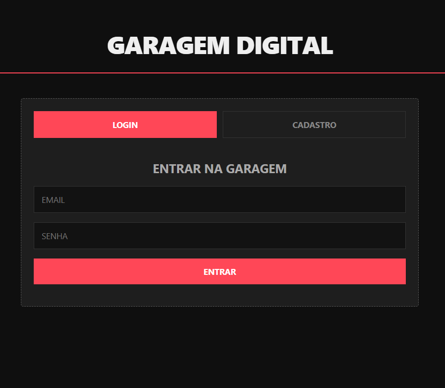
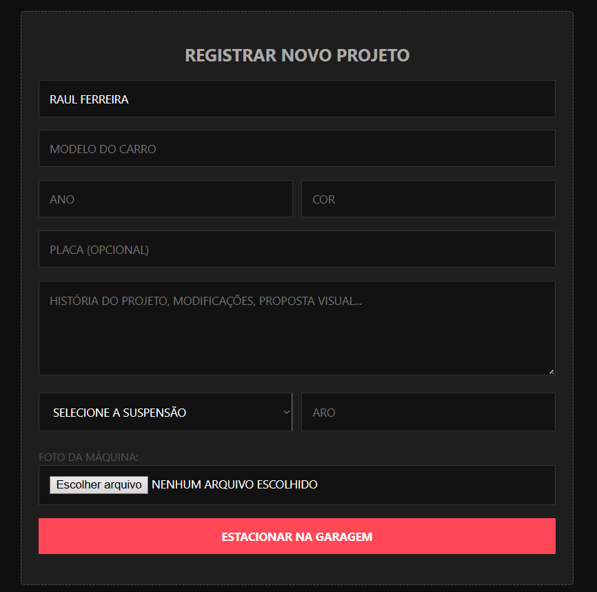
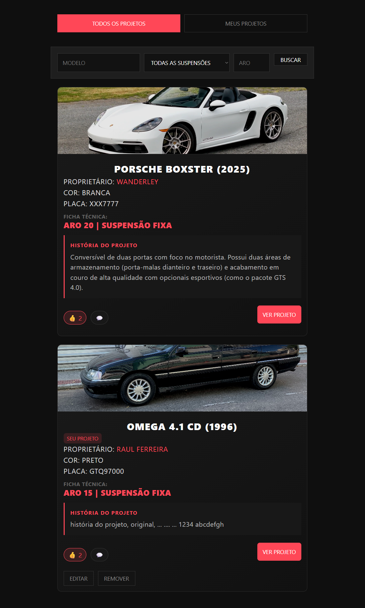
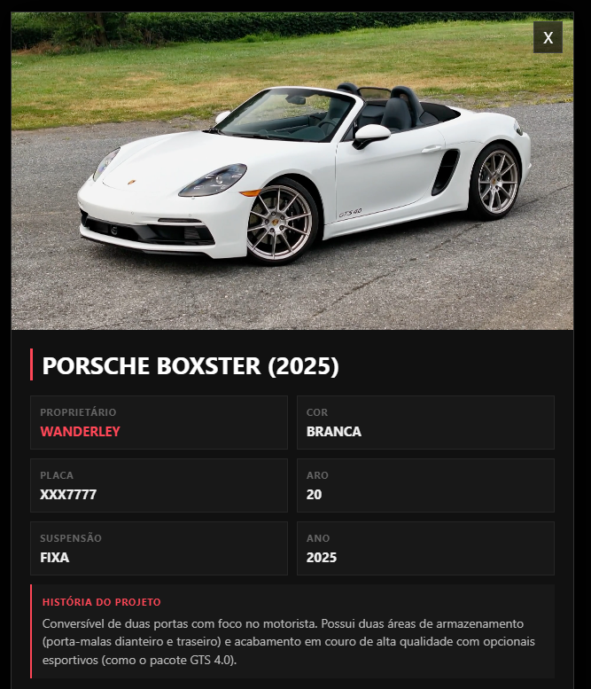
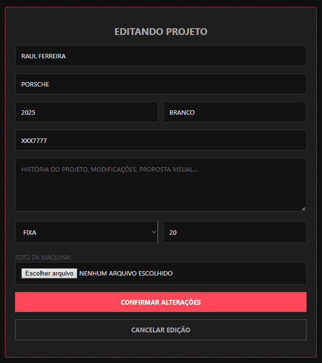
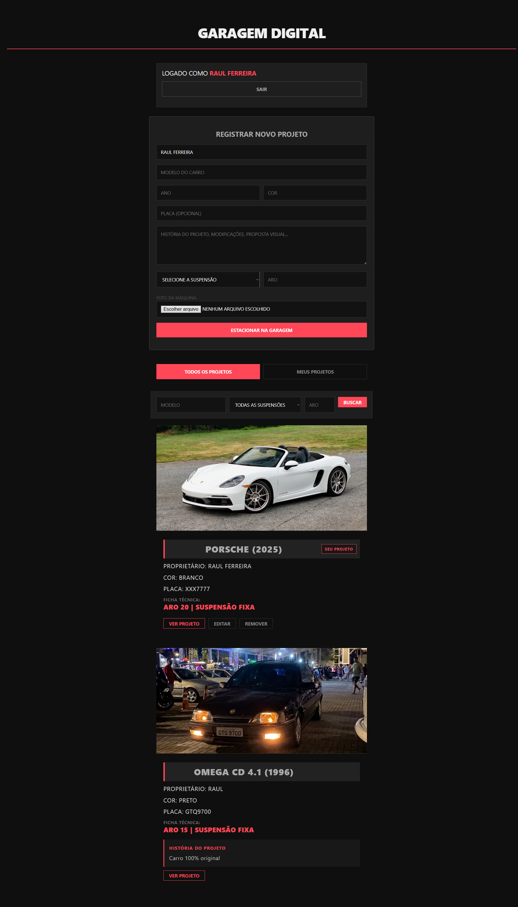

# Garagem Digital - Cultura da Lata 027 🚘

Uma aplicação web Full Stack criada para catalogar, documentar e exibir projetos automotivos da cena de rua — antigos, rebaixados, modificados, daily cars e projetos em andamento.

O projeto nasceu com a proposta de criar uma **garagem digital** fora dos algoritmos das redes sociais tradicionais, valorizando a identidade de cada carro, sua ficha técnica, sua história e a cultura automotiva local.

Atualmente, a aplicação evoluiu de um CRUD de veículos para a base inicial de uma plataforma automotiva com cadastro de usuários, login, garagem pessoal, feed geral de projetos e controle de propriedade por usuário.

A interface utiliza uma estética escura, minimalista e low profile, inspirada em revistas automotivas modernas, dando destaque absoluto às máquinas e suas configurações reais.

---

## 🛠️ Tecnologias Utilizadas

- **Back-end:** Python + Flask
- **Banco de Dados:** MySQL / MariaDB
- **Front-end:** HTML5, CSS3 e JavaScript Vanilla
- **Autenticação:** Cadastro e login de usuários
- **Segurança:** Hash de senha com Werkzeug
- **Upload:** Validação de imagem e nomes únicos com UUID
- **Configuração:** Variáveis de ambiente com python-dotenv
- **Controle de Versão:** Git / GitHub

---

## ⚙️ Funcionalidades

- [x] **Cadastro de Usuários:** criação de contas com nome, email e senha.
- [x] **Login de Usuários:** autenticação simples para acessar a aplicação.
- [x] **Hash de Senha:** senhas dos usuários não são salvas em texto puro no banco.
- [x] **Catálogo Dinâmico:** listagem de veículos consumindo API REST.
- [x] **Feed Geral:** aba com todos os projetos cadastrados na plataforma.
- [x] **Garagem Pessoal:** aba com apenas os projetos do usuário logado.
- [x] **Cadastro de Projetos:** criação de veículos com ficha técnica completa.
- [x] **Vínculo com Usuário:** cada projeto fica associado ao usuário que cadastrou.
- [x] **Controle de Propriedade:** apenas o dono do projeto pode editar ou remover.
- [x] **Selo de Identificação:** projetos do usuário logado exibem a tag “Seu projeto”.
- [x] **Edição de Projetos:** alteração de dados do veículo pelo proprietário.
- [x] **Exclusão de Projetos:** remoção permitida somente ao dono do projeto.
- [x] **História do Projeto:** campo para descrição, modificações e proposta visual.
- [x] **Visualização Detalhada:** modal com informações completas do carro.
- [x] **Upload de Imagens:** envio de fotos via formulário.
- [x] **Validação de Upload:** aceita apenas PNG, JPG, JPEG e WEBP.
- [x] **Nome Único para Imagens:** evita sobrescrita de arquivos com UUID.
- [x] **Limite de Upload:** arquivos limitados a 5 MB.
- [x] **Filtros de Busca:** busca por modelo, tipo de suspensão e aro.
- [x] **Mensagem de Lista Vazia:** feedback visual quando não há projetos encontrados.
- [x] **Modo de Edição:** interface muda visualmente ao editar um projeto.
- [x] **Interface Responsiva:** ajustes para melhor uso em dispositivos móveis.
- [x] **Página Completa Documentada:** screenshot geral mostrando a aplicação em funcionamento.
- [x] **SQL Limpo:** script de banco sem dados pessoais ou sensíveis.

---

## 📸 Interface e Demonstração

### Cadastro e Login de Usuários



*Área inicial da aplicação com autenticação de usuários.*

### Registro de Projetos



*Formulário de cadastro com ficha técnica, upload de imagem e história do projeto.*

### Feed Geral de Projetos



*Aba com todos os projetos cadastrados na Garagem Digital.*

### Garagem Pessoal


*Aba “Meus projetos”, exibindo apenas os veículos cadastrados pelo usuário logado.*

### Visualização Detalhada



*Modal com imagem, ficha técnica completa e história do projeto.*

### Edição pelo Proprietário



*Modo de edição disponível apenas para o usuário proprietário do projeto.*

### Página Completa



*Visão geral da aplicação com autenticação, cadastro de projetos, filtros e listagem da garagem.*

---

## 🔐 Segurança e Controle de Acesso

O projeto foi evoluído para aplicar boas práticas básicas de segurança e organização:

- credenciais do banco removidas do código-fonte;
- uso de arquivo `.env` para configuração local;
- `.env` ignorado pelo Git;
- `.env.example` disponível como modelo;
- senhas de usuários armazenadas com hash;
- validação de formato de imagem no front-end e no back-end;
- limite de tamanho para upload;
- geração de nomes únicos para imagens;
- remoção de dados pessoais do script SQL;
- vínculo de projetos ao usuário proprietário;
- edição e exclusão permitidas apenas ao dono do projeto.

> Observação: a autenticação atual é simples e adequada para fins de estudo/portfólio. Futuramente, o projeto pode evoluir para uso de sessões, tokens JWT ou outro modelo mais robusto de autenticação.

---

## 🗄️ Banco de Dados

O projeto utiliza MySQL/MariaDB.

O arquivo `garagem_digital.sql` cria a estrutura necessária para a aplicação, incluindo:

- banco `garagem_digital`;
- tabela `usuarios`;
- tabela `carros`;
- relacionamento entre carros e usuários;
- campos principais da ficha técnica;
- campo de história/descrição do projeto;
- campos de data `criado_em` e `atualizado_em`.

> Observação: os dados de teste devem ser criados pela própria aplicação para garantir que senhas e vínculos sejam salvos corretamente.

---

## 🚀 Como rodar o projeto na sua máquina

### 1. Clone este repositório

```bash
git clone https://github.com/raullferreiraa/garagem-digital.git
```

### 2. Acesse a pasta do projeto

```bash
cd garagem-digital
```

### 3. Instale as dependências

```bash
pip install -r requirements.txt
```

### 4. Configure as variáveis de ambiente

Crie um arquivo `.env` na raiz do projeto com base no `.env.example`.

Exemplo:

```env
DB_HOST=localhost
DB_USER=root
DB_PASSWORD=
DB_NAME=garagem_digital

DEBUG=True
```

### 5. Configure o banco de dados

Importe o arquivo:

```txt
garagem_digital.sql
```

Você pode importar pelo phpMyAdmin ou pelo terminal do MySQL.

### 6. Inicie o servidor Flask

```bash
python app.py
```

O servidor será iniciado em:

```txt
http://127.0.0.1:5000
```

### 7. Acesse a aplicação

Abra o arquivo `index.html` diretamente no navegador.

---

## 📁 Estrutura do Projeto

```txt
garagem-digital/
├── app.py
├── index.html
├── garagem_digital.sql
├── requirements.txt
├── .env.example
├── .gitignore
├── screenshots/
└── uploads/
```

> A pasta `uploads/` é criada automaticamente durante a execução do projeto e não é versionada no GitHub.

---

## 🧭 Roadmap

Próximas evoluções planejadas:

- [ ] Adicionar sistema de curtidas em projetos.
- [ ] Adicionar comentários em projetos.
- [ ] Criar perfis públicos de usuários.
- [ ] Criar sistema de equipes/clubes automotivos.
- [ ] Permitir que usuários adicionem carros a uma equipe.
- [ ] Criar grupos para postagens, fotos e discussões.
- [ ] Adicionar categorias como Antigo, Rebaixado, Turbo, Daily e Projeto em andamento.
- [ ] Adicionar ordenação por mais recentes, ano, aro e modelo.
- [ ] Separar CSS e JavaScript em arquivos próprios.
- [ ] Melhorar autenticação com sessões ou tokens.
- [ ] Criar deploy online.
- [ ] Gravar demonstração do sistema.

---

## 🎯 Aprendizados

Durante o desenvolvimento, foram praticados conceitos como:

- criação de API REST com Flask;
- integração entre front-end, back-end e banco de dados;
- autenticação básica de usuários;
- relacionamento entre tabelas no banco de dados;
- associação de registros ao usuário proprietário;
- controle de permissão para edição e exclusão;
- manipulação de formulários com `FormData`;
- upload e armazenamento de arquivos;
- consultas SQL com filtros dinâmicos;
- uso de hash para armazenamento seguro;
- configuração de ambiente com `.env`;
- organização de projeto para GitHub e portfólio;
- evolução incremental de um CRUD para uma aplicação com características sociais.

---

## 👨‍💻 Autor

Projeto desenvolvido por **Raul Ferreira** como parte dos estudos em Ciência da Computação na UVV, unindo desenvolvimento web, persistência de dados, aprendizado prático e cultura automotiva.