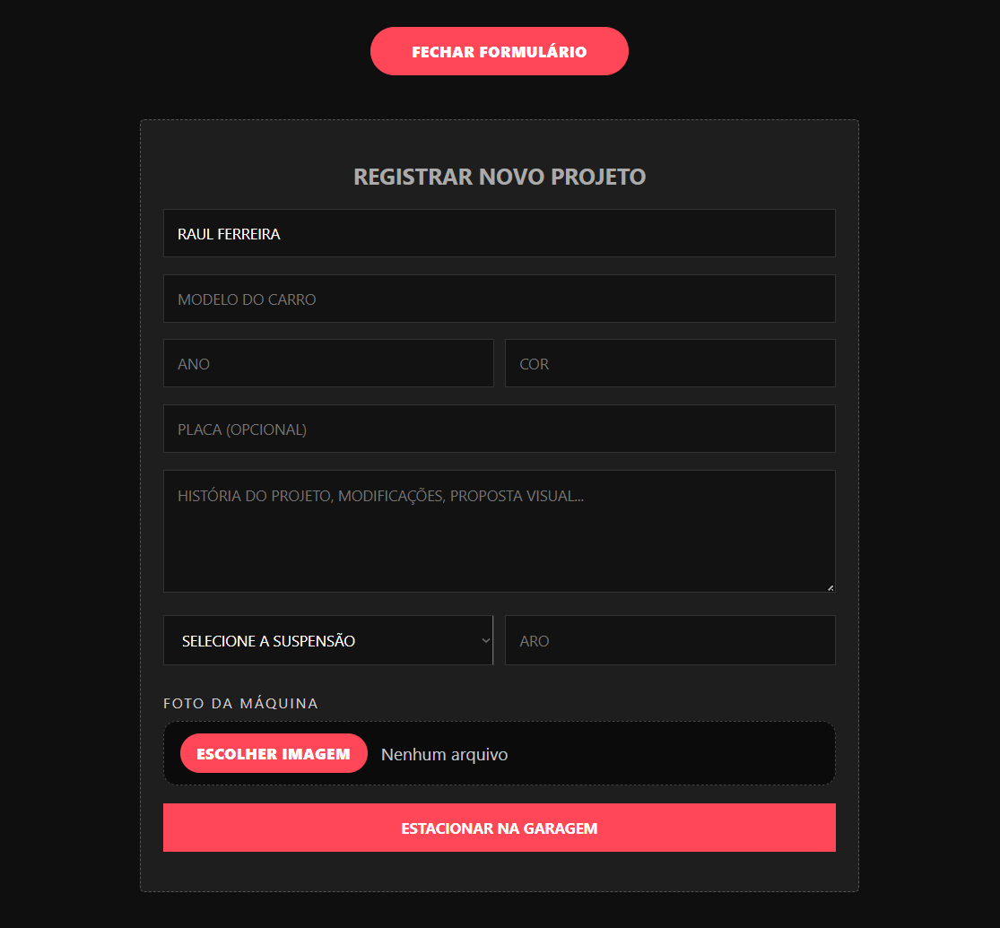
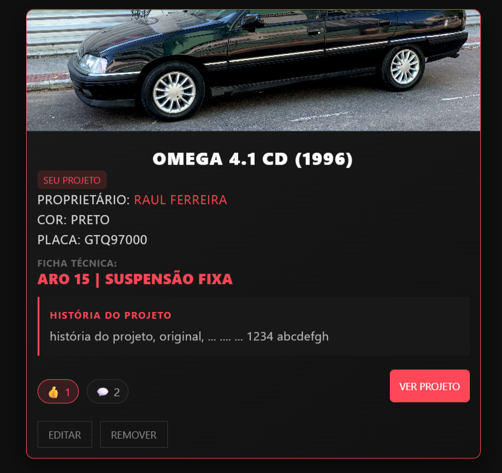
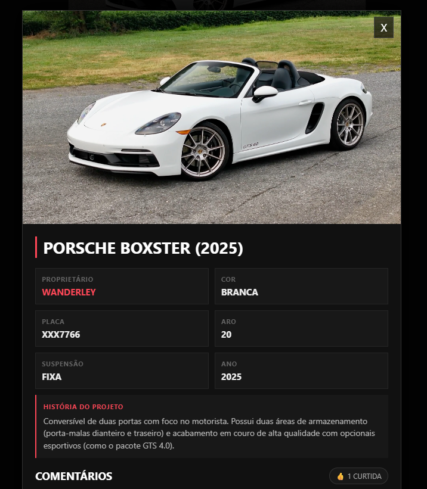
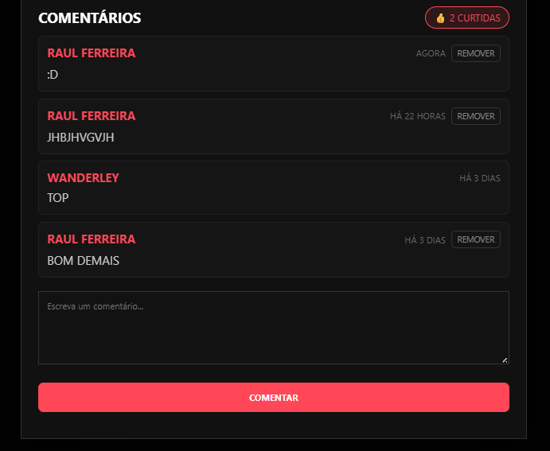
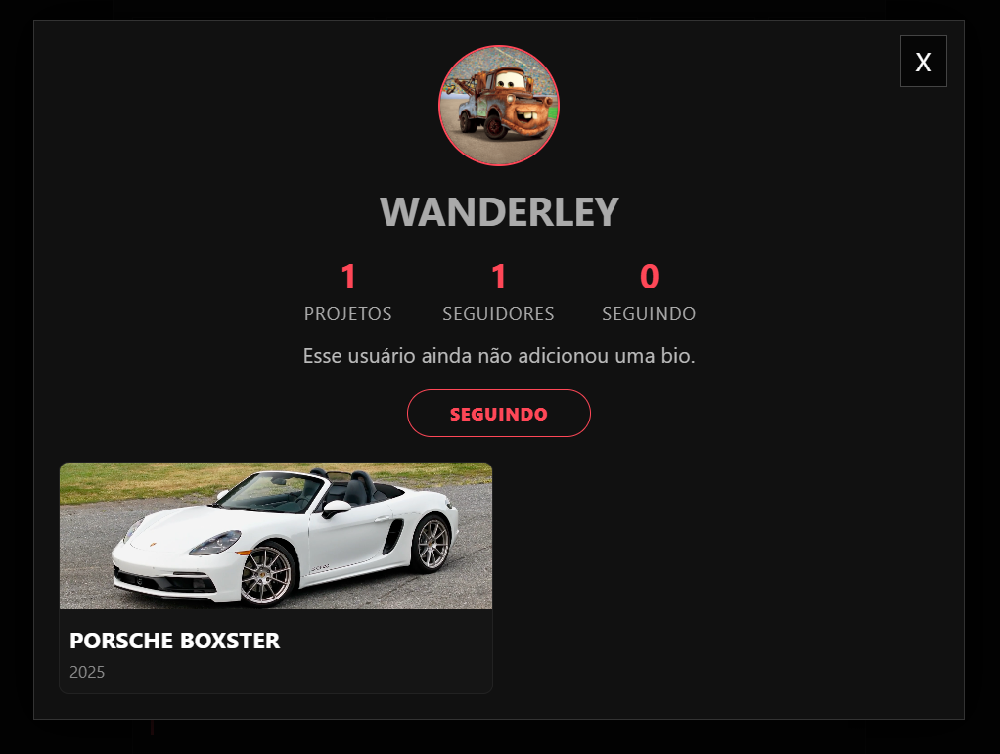
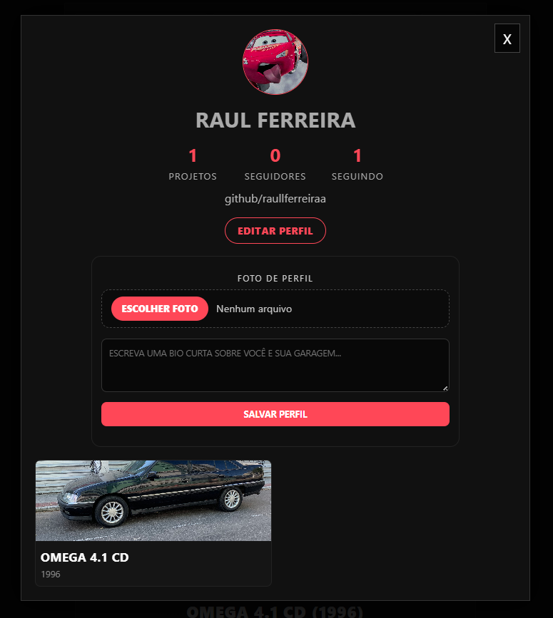
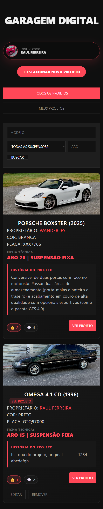

# Garagem Digital - Cultura da Lata 027 🚘

Uma aplicação web full stack criada para catalogar, documentar e exibir projetos automotivos da cena de rua — antigos, rebaixados, modificados, daily cars e projetos em andamento.

O projeto nasceu com a proposta de criar uma **garagem digital** fora dos algoritmos das redes sociais tradicionais, valorizando a identidade de cada carro, sua ficha técnica, sua história e a cultura automotiva local.

A Garagem Digital evoluiu de um CRUD de veículos para a base inicial de uma plataforma automotiva social, com autenticação, garagem pessoal, feed geral, curtidas, comentários, perfis de usuário, avatar, bio, seguidores, controle de propriedade, upload de imagens e uma interface dark premium.

A interface utiliza uma estética escura, minimalista e low profile, inspirada em revistas automotivas modernas e aplicativos sociais, dando destaque às máquinas, suas configurações reais e suas histórias.

---

## 📌 Status do Projeto

🚧 Projeto em evolução.

A Garagem Digital já conta com cadastro e login de usuários, senhas com hash, cadastro de projetos automotivos, upload de imagens, feed geral, área de projetos pessoais, filtros de busca, sistema de curtidas, sistema de comentários, contador de comentários, tempo relativo nos comentários, remoção de comentário próprio, modal de visualização detalhada, perfis com avatar e bio, edição do próprio perfil, upload de avatar, seguidores/seguindo, menu de usuário logado e controle de propriedade para edição e exclusão de projetos.

As próximas melhorias planejadas incluem refinamento mobile, feed social personalizado, ranking de projetos, edição de comentários, organização técnica do front-end, melhorias de autenticação e deploy online.

---

## 🛠️ Tecnologias Utilizadas

- **Back-end:** Python + Flask
- **Banco de Dados:** MySQL / MariaDB
- **Front-end:** HTML5, CSS3 e JavaScript Vanilla
- **Autenticação:** Cadastro e login de usuários
- **Segurança:** Hash de senha com Werkzeug
- **Upload:** Validação de imagens, nomes únicos e organização em pastas
- **Configuração:** Variáveis de ambiente com python-dotenv
- **Controle de Versão:** Git / GitHub
- **Fluxo de Desenvolvimento:** Issues, branches, commits, pull requests e merges

---

## ⚙️ Funcionalidades

- [x] **Cadastro de Usuários:** criação de contas com nome, email e senha.
- [x] **Login de Usuários:** autenticação simples para acessar a aplicação.
- [x] **Hash de Senha:** senhas dos usuários não são salvas em texto puro no banco.
- [x] **Catálogo Dinâmico:** listagem de veículos consumindo API REST.
- [x] **Feed Geral:** aba com todos os projetos cadastrados na plataforma.
- [x] **Garagem Pessoal:** aba com apenas os projetos do usuário logado.
- [x] **Cadastro de Projetos:** criação de veículos com ficha técnica completa.
- [x] **Formulário Recolhível:** o cadastro de projeto fica escondido por padrão e abre pelo botão `+ Estacionar novo projeto`.
- [x] **Vínculo com Usuário:** cada projeto fica associado ao usuário que cadastrou.
- [x] **Controle de Propriedade:** apenas o dono do projeto pode editar ou remover.
- [x] **Selo de Identificação:** projetos do usuário logado exibem a tag “Seu projeto”.
- [x] **Edição de Projetos:** alteração de dados do veículo pelo proprietário.
- [x] **Exclusão de Projetos:** remoção permitida somente ao dono do projeto.
- [x] **História do Projeto:** campo para descrição, modificações e proposta visual.
- [x] **Visualização Detalhada:** modal com imagem, ficha técnica completa, história, curtidas e comentários.
- [x] **Upload de Imagens:** envio de fotos dos projetos via formulário.
- [x] **Upload de Avatar:** envio de foto de perfil pelo dispositivo.
- [x] **Validação de Upload:** aceita apenas PNG, JPG, JPEG e WEBP.
- [x] **Nome Único para Imagens:** evita sobrescrita de arquivos.
- [x] **Campos de Upload Estilizados:** uploads exibem botão visual e nome do arquivo selecionado.
- [x] **Filtros de Busca:** busca por modelo, tipo de suspensão e aro.
- [x] **Sistema de Curtidas:** usuários logados podem curtir e remover curtidas dos projetos.
- [x] **Curtidas no Modal:** o usuário pode curtir ou remover curtida diretamente na visualização detalhada.
- [x] **Contador de Curtidas:** cada projeto exibe o total de curtidas recebidas.
- [x] **Estado de Curtida por Usuário:** a interface indica se o usuário já curtiu o projeto.
- [x] **Animação de Curtida:** feedback visual com animação e partículas.
- [x] **Sistema de Comentários:** usuários logados podem comentar em projetos.
- [x] **Comentários no Modal:** comentários são exibidos dentro da visualização detalhada do projeto.
- [x] **Contador de Comentários:** cards exibem o total de comentários do projeto.
- [x] **Tempo Relativo nos Comentários:** comentários exibem tempo como “há 5 minutos”.
- [x] **Remoção de Comentário Próprio:** o autor pode remover seu próprio comentário.
- [x] **Perfil de Usuário:** exibe avatar, nome, bio, contadores sociais e projetos cadastrados.
- [x] **Edição do Próprio Perfil:** usuário pode editar bio e foto de perfil.
- [x] **Seguidores e Seguindo:** usuários podem seguir e deixar de seguir outros perfis.
- [x] **Contadores Sociais:** perfil mostra total de projetos, seguidores e seguindo.
- [x] **Cards Clicáveis no Perfil:** carros exibidos no perfil podem abrir a visualização detalhada.
- [x] **Nomes Clicáveis:** nome do proprietário e autor de comentário podem abrir o perfil.
- [x] **Menu do Usuário Logado:** menu/dropdown com avatar, nome, botão de perfil e sair.
- [x] **Mensagem de Lista Vazia:** feedback visual quando não há projetos encontrados.
- [x] **Modo de Edição:** interface muda visualmente ao editar um projeto.
- [x] **Interface Dark Premium:** cards, botões, modal, perfil e menu com visual mais moderno.
- [x] **Interface Responsiva:** ajustes para melhor uso em dispositivos móveis.
- [x] **SQL Limpo:** script de banco sem dados pessoais ou sensíveis.

---

## 📸 Interface e Demonstração

### Cadastro e Login de Usuários


*Área inicial da aplicação com autenticação de usuários.*

### Feed Geral de Projetos


*Tela principal logada com menu do usuário, botão de novo projeto, filtros, abas e cards da garagem.*

### Cadastro de Projeto



*Formulário recolhível para cadastrar um novo projeto automotivo com ficha técnica, história e upload de imagem.*

### Card de Projeto



*Card de projeto com imagem, informações principais, curtidas, comentários, botão de visualização e ações do proprietário.*

### Visualização Detalhada do Projeto



*Modal com imagem ampliada, ficha técnica, história do projeto, curtidas e área social.*

### Comentários



*Área de comentários com autor clicável, tempo relativo, remoção de comentário próprio e campo para novo comentário.*

### Perfil de Usuário



*Perfil com avatar, nome, bio, contadores de projetos, seguidores, seguindo e cards dos projetos cadastrados.*

### Edição de Perfil



*Área de edição do próprio perfil com upload de avatar, campo de bio e botão de salvar.*

### Menu do Usuário Logado


*Menu/dropdown do usuário logado com avatar, nome, ação para ver perfil e botão de sair.*

### Prévia Mobile



*Prévia da aplicação em tela menor, mostrando a adaptação da interface para uso mobile.*

---

## 🔐 Segurança e Controle de Acesso

O projeto foi evoluído para aplicar boas práticas básicas de segurança e organização:

- Credenciais do banco removidas do código-fonte.
- Uso de arquivo `.env` para configuração local.
- `.env` ignorado pelo Git.
- `.env.example` disponível como modelo.
- Senhas de usuários armazenadas com hash.
- Validação de formato de imagem no front-end e no back-end.
- Limitação de tamanho para upload de avatar no front-end.
- Geração de nomes únicos para imagens de projetos e avatares.
- Armazenamento de avatares em subpasta própria.
- Remoção de dados pessoais do script SQL.
- Vínculo de projetos ao usuário proprietário.
- Edição e exclusão permitidas apenas ao dono do projeto.
- Edição de perfil permitida apenas ao próprio usuário.
- Upload de avatar permitido apenas ao próprio usuário.
- Curtidas vinculadas ao usuário logado.
- Prevenção de curtidas duplicadas por meio de restrição única no banco.
- Comentários vinculados ao usuário logado.
- Remoção de comentário permitida apenas ao autor do comentário.
- Sistema de seguir/deixar de seguir com bloqueio para impedir seguir a si mesmo.
- Controle visual para exibir ações de edição e exclusão apenas ao proprietário.

> Observação: a autenticação atual é simples e adequada para fins de estudo/portfólio. Futuramente, o projeto pode evoluir para uso de sessões, tokens JWT ou outro modelo mais robusto de autenticação.

---

## 🗄️ Banco de Dados

O projeto utiliza MySQL/MariaDB.

O arquivo `garagem_digital.sql` cria a estrutura necessária para a aplicação, incluindo:

- Banco `garagem_digital`.
- Tabela `usuarios`.
- Tabela `carros`.
- Tabela `curtidas`.
- Tabela `comentarios`.
- Tabela `seguidores`.
- Relacionamento entre carros e usuários.
- Relacionamento entre curtidas, usuários e carros.
- Relacionamento entre comentários, usuários e carros.
- Relacionamento entre seguidores e usuários.
- Campos `avatar_url` e `bio` na tabela `usuarios`.
- Campos principais da ficha técnica.
- Campo de história/descrição do projeto.
- Campos de data `criado_em` e `atualizado_em`.

> Observação: os dados de teste devem ser criados pela própria aplicação para garantir que senhas, vínculos, curtidas, comentários, seguidores e permissões sejam salvos corretamente.

---

## 🚀 Como rodar o projeto na sua máquina

### 1. Clone este repositório

```bash
git clone https://github.com/raullferreiraa/garagem-digital.git
```

### 2. Acesse a pasta do projeto

```bash
cd garagem-digital
```

### 3. Instale as dependências

```bash
pip install -r requirements.txt
```

### 4. Configure as variáveis de ambiente

Crie um arquivo `.env` na raiz do projeto com base no `.env.example`.

Exemplo:

```env
DB_HOST=localhost
DB_USER=root
DB_PASSWORD=
DB_NAME=garagem_digital
DEBUG=True
```

### 5. Configure o banco de dados

Importe o arquivo:

```text
garagem_digital.sql
```

Você pode importar pelo phpMyAdmin ou pelo terminal do MySQL.

### 6. Inicie o servidor Flask

```bash
python app.py
```

O servidor será iniciado em:

```text
http://127.0.0.1:5000
```

### 7. Acesse a aplicação

Abra o arquivo `index.html` diretamente no navegador.

---

## 📁 Estrutura do Projeto

```text
garagem-digital/
├── app.py
├── index.html
├── garagem_digital.sql
├── requirements.txt
├── .env.example
├── .gitignore
├── README.md
├── screenshots/
└── uploads/
    └── avatars/
```

> A pasta `uploads/` é criada automaticamente durante a execução do projeto e não é versionada no GitHub.

---

## 🧭 Roadmap

Próximas evoluções planejadas:

- [x] Adicionar sistema de curtidas em projetos.
- [x] Adicionar comentários em projetos.
- [x] Criar perfis públicos de usuários.
- [x] Adicionar avatar/foto de perfil.
- [x] Adicionar bio no perfil.
- [x] Permitir edição do próprio perfil.
- [x] Criar sistema de seguidores e seguindo.
- [x] Melhorar visual dos cards e modal.
- [x] Permitir excluir comentários próprios.
- [x] Exibir tempo relativo nos comentários, como “há 5 minutos”.
- [x] Melhorar campos de upload de imagem.
- [x] Melhorar menu do usuário logado.
- [ ] Permitir editar comentários próprios.
- [ ] Criar feed social personalizado.
- [ ] Criar ranking de projetos.
- [ ] Criar sistema de equipes/clubes automotivos.
- [ ] Permitir que usuários adicionem carros a uma equipe.
- [ ] Criar grupos para postagens, fotos e discussões.
- [ ] Adicionar categorias como Antigo, Rebaixado, Turbo, Daily e Projeto em andamento.
- [ ] Adicionar ordenação por mais recentes, ano, aro e modelo.
- [ ] Melhorar responsividade mobile.
- [ ] Separar CSS e JavaScript em arquivos próprios.
- [ ] Melhorar autenticação com sessões ou tokens.
- [ ] Criar deploy online.
- [ ] Gravar demonstração do sistema.

---

## 🎯 Aprendizados

Durante o desenvolvimento, foram praticados conceitos como:

- Criação de API REST com Flask.
- Integração entre front-end, back-end e banco de dados.
- Autenticação básica de usuários.
- Relacionamento entre tabelas no banco de dados.
- Associação de registros ao usuário proprietário.
- Controle de permissão para edição e exclusão.
- Manipulação de formulários com `FormData`.
- Upload e armazenamento de arquivos.
- Validação de imagens no front-end e no back-end.
- Consultas SQL com filtros dinâmicos.
- Sistema de curtidas com controle por usuário.
- Sistema de comentários associado a usuários e projetos.
- Criação de perfis de usuário com avatar, bio e projetos.
- Sistema de seguidores e seguindo.
- Atualização dinâmica da interface com JavaScript puro.
- Controle de estado visual de curtidas.
- Criação de modal de visualização detalhada.
- Criação de menu/dropdown para usuário logado.
- Uso de hash para armazenamento seguro de senhas.
- Configuração de ambiente com `.env`.
- Organização de projeto para GitHub e portfólio.
- Uso de issues, branches e pull requests.
- Resolução de conflitos de branch.
- Evolução incremental de um CRUD para uma aplicação com características sociais.

---

## 👨‍💻 Autor

Projeto desenvolvido por **Raul Ferreira** como parte dos estudos em Ciência da Computação na UVV, unindo desenvolvimento web, persistência de dados, aprendizado prático e cultura automotiva.