# Garagem Digital 🚘

Uma aplicação web full stack criada para catalogar, documentar e exibir projetos automotivos da cena de rua — antigos, rebaixados, modificados, daily cars e projetos em andamento.

O projeto nasceu com a proposta de criar uma **garagem digital** fora dos algoritmos das redes sociais tradicionais, valorizando a identidade de cada carro, sua ficha técnica, sua história e a cultura automotiva local.

A Garagem Digital evoluiu de um CRUD de veículos para a base inicial de uma plataforma automotiva social, com autenticação, usuários, feed geral, garagem pessoal, curtidas, comentários, seguidores, perfis, avatar, bio, `@username`, feedback visual e sistema inicial de equipes automotivas.

A interface utiliza uma estética escura, minimalista e low profile, inspirada em revistas automotivas modernas e aplicativos sociais, dando destaque às máquinas, suas configurações reais e suas histórias.

---

## 📌 Status do Projeto

🚧 Projeto em evolução.

A Garagem Digital já conta com cadastro e login de usuários, senhas com hash, cadastro de projetos automotivos, upload de imagens, feed geral, área de projetos pessoais, filtros de busca, sistema de curtidas, sistema de comentários, contador de comentários, tempo relativo nos comentários, remoção de comentário próprio, modal de visualização detalhada, perfis com avatar, bio e `@username`, edição do próprio perfil, upload de avatar, seguidores/seguindo, menu de usuário logado, controle de propriedade para edição e exclusão de projetos e uma interface dark premium responsiva.

O projeto também possui uma base inicial de **equipes automotivas**, permitindo criar equipes, visualizar detalhes, exibir equipe no perfil, pedir para entrar, mostrar status de pedido pendente e aprovar ou recusar solicitações de entrada.

Recentemente, o front-end também foi organizado separando os estilos em `style.css` e o JavaScript em `script.js`, deixando o projeto mais limpo e preparado para futuras manutenções.

As próximas melhorias planejadas incluem garagem coletiva da equipe, convites, cargos de equipe, notificações, feed social personalizado, ranking de projetos, autenticação mais robusta e deploy online.

---

## 🛠️ Tecnologias Utilizadas

- **Back-end:** Python + Flask
- **Banco de Dados:** MySQL / MariaDB
- **Front-end:** HTML5, CSS3 e JavaScript Vanilla
- **Estilos:** CSS separado em `style.css`
- **Scripts:** JavaScript separado em `script.js`
- **Autenticação:** Cadastro e login de usuários
- **Segurança:** Hash de senha com Werkzeug
- **Upload:** Validação de imagens, nomes únicos e organização em pastas
- **Configuração:** Variáveis de ambiente com python-dotenv
- **Controle de Versão:** Git / GitHub
- **Fluxo de Desenvolvimento:** Issues, branches, commits, pull requests e merges

---

## ⚙️ Funcionalidades

- [x] **Cadastro de Usuários:** criação de contas com nome, email, senha e nome de usuário.
- [x] **Login de Usuários:** autenticação simples para acessar a aplicação.
- [x] **Hash de Senha:** senhas dos usuários não são salvas em texto puro no banco.
- [x] **Username Único:** usuários possuem `@username` único para identificação social.
- [x] **Catálogo Dinâmico:** listagem de veículos consumindo API REST.
- [x] **Feed Geral:** aba com todos os projetos cadastrados na plataforma.
- [x] **Garagem Pessoal:** aba com apenas os projetos do usuário logado.
- [x] **Cadastro de Projetos:** criação de veículos com ficha técnica completa.
- [x] **Formulário Recolhível:** o cadastro de projeto fica escondido por padrão e abre pelo botão `+ Estacionar novo projeto`.
- [x] **Vínculo com Usuário:** cada projeto fica associado ao usuário que cadastrou.
- [x] **Controle de Propriedade:** apenas o dono do projeto pode editar ou remover.
- [x] **Selo de Identificação:** projetos do usuário logado exibem a tag “Seu projeto”.
- [x] **Edição de Projetos:** alteração de dados do veículo pelo proprietário.
- [x] **Exclusão de Projetos:** remoção permitida somente ao dono do projeto.
- [x] **História do Projeto:** campo para descrição, modificações e proposta visual.
- [x] **Visualização Detalhada:** modal com imagem, ficha técnica completa, história, curtidas e comentários.
- [x] **Upload de Imagens:** envio de fotos dos projetos via formulário.
- [x] **Upload de Avatar:** envio de foto de perfil pelo dispositivo.
- [x] **Validação de Upload:** aceita apenas PNG, JPG, JPEG e WEBP.
- [x] **Nome Único para Imagens:** evita sobrescrita de arquivos.
- [x] **Campos de Upload Estilizados:** uploads exibem botão visual e nome do arquivo selecionado.
- [x] **Filtros de Busca:** busca por modelo, tipo de suspensão e aro.
- [x] **Sistema de Curtidas:** usuários logados podem curtir e remover curtidas dos projetos.
- [x] **Curtidas no Modal:** o usuário pode curtir ou remover curtida diretamente na visualização detalhada.
- [x] **Contador de Curtidas:** cada projeto exibe o total de curtidas recebidas.
- [x] **Estado de Curtida por Usuário:** a interface indica se o usuário já curtiu o projeto.
- [x] **Animação de Curtida:** feedback visual com animação e partículas.
- [x] **Sistema de Comentários:** usuários logados podem comentar em projetos.
- [x] **Comentários no Modal:** comentários são exibidos dentro da visualização detalhada do projeto.
- [x] **Contador de Comentários:** cards exibem o total de comentários do projeto.
- [x] **Tempo Relativo nos Comentários:** comentários exibem tempo como “há 5 minutos”.
- [x] **Remoção de Comentário Próprio:** o autor pode remover seu próprio comentário.
- [x] **Perfil de Usuário:** exibe avatar, nome, `@username`, bio, contadores sociais e projetos cadastrados.
- [x] **Edição do Próprio Perfil:** usuário pode editar bio e foto de perfil.
- [x] **Seguidores e Seguindo:** usuários podem seguir e deixar de seguir outros perfis.
- [x] **Contadores Sociais:** perfil mostra total de projetos, seguidores e seguindo.
- [x] **Cards Clicáveis no Perfil:** carros exibidos no perfil podem abrir a visualização detalhada.
- [x] **Nomes Clicáveis:** nome do proprietário e autor de comentário podem abrir o perfil.
- [x] **Menu do Usuário Logado:** menu/dropdown com avatar, nome, `@username`, perfil, equipe e sair.
- [x] **Mensagem de Lista Vazia:** feedback visual quando não há projetos encontrados.
- [x] **Modo de Edição:** interface muda visualmente ao editar um projeto.
- [x] **Interface Dark Premium:** cards, botões, modal, perfil e menu com visual mais moderno.
- [x] **Interface Responsiva:** ajustes para melhor uso em dispositivos móveis.
- [x] **Equipes Automotivas:** base inicial para criação e visualização de equipes.
- [x] **Minha Equipe:** modal dedicado para mostrar a equipe do usuário ou equipes disponíveis.
- [x] **Detalhe da Equipe:** visualização com nome, descrição, criador, membros e espaço futuro para garagem coletiva.
- [x] **Equipe no Perfil:** perfil exibe um bloco compacto da equipe quando o usuário participa de uma.
- [x] **Pedidos de Entrada:** usuários sem equipe podem pedir para entrar em uma equipe.
- [x] **Status de Pedido Pendente:** a interface mostra quando o usuário já enviou uma solicitação.
- [x] **Aprovação e Recusa de Pedidos:** criador da equipe pode aprovar ou recusar solicitações.
- [x] **Feedback Visual Global:** mensagens visuais de sucesso, erro e aviso integradas à interface.
- [x] **CSS Separado:** estilos organizados no arquivo `style.css`.
- [x] **JavaScript Separado:** scripts organizados no arquivo `script.js`.
- [x] **SQL Limpo:** script de banco sem dados pessoais ou sensíveis.

---

## 📸 Interface e Demonstração

### Cadastro e Login de Usuários

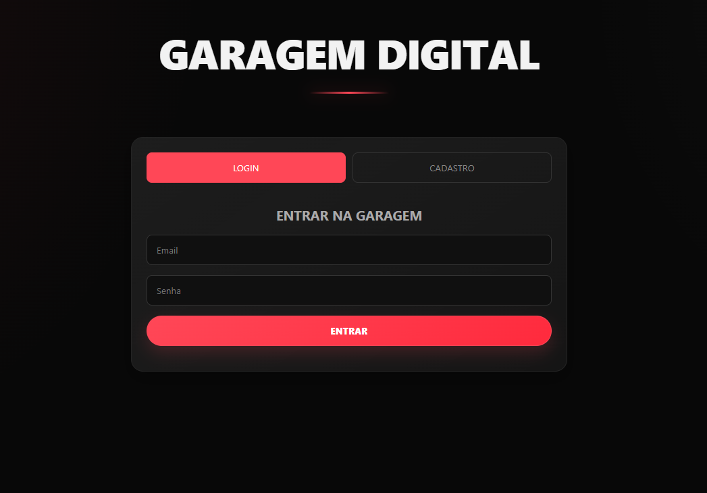

*Área inicial da aplicação com autenticação de usuários, visual dark premium e campos de entrada para acessar ou criar uma conta.*

### Feed Geral de Projetos

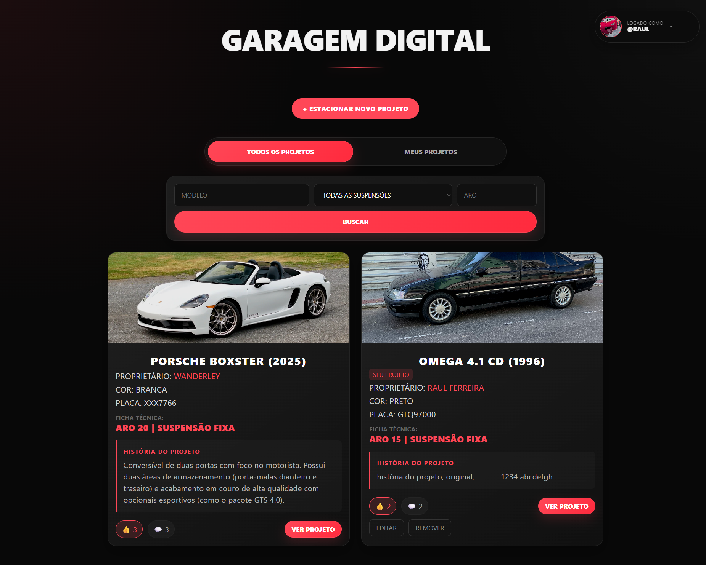

*Tela principal logada com feed geral de projetos, menu do usuário, filtros de busca, botão de novo projeto e listagem da garagem.*

### Cards de Projetos

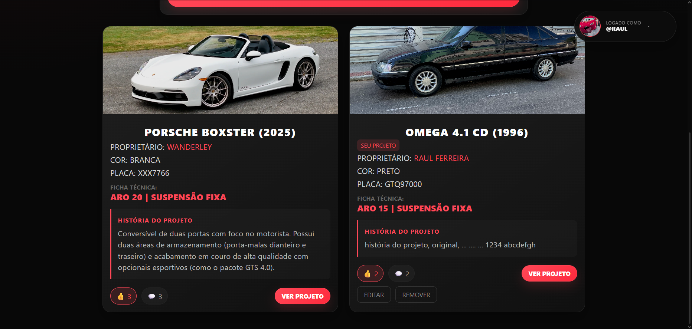

*Cards dos projetos automotivos com imagem, informações principais, proprietário, curtidas, comentários, botão de visualização e ações disponíveis para o dono.*

### Visualização Detalhada do Projeto

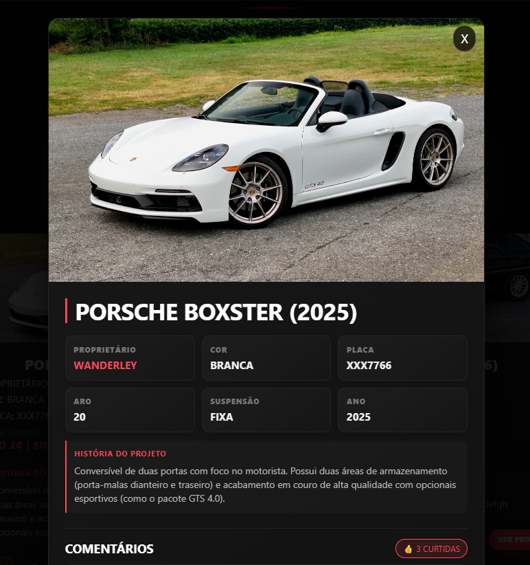

*Modal com imagem ampliada, ficha técnica, história do projeto, proprietário clicável, curtidas e área social.*

### Comentários

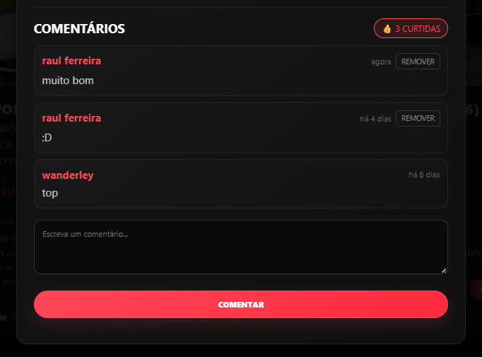

*Área de comentários dentro do projeto, com autor clicável, tempo relativo, campo para novo comentário e remoção de comentário próprio.*

### Perfil de Usuário

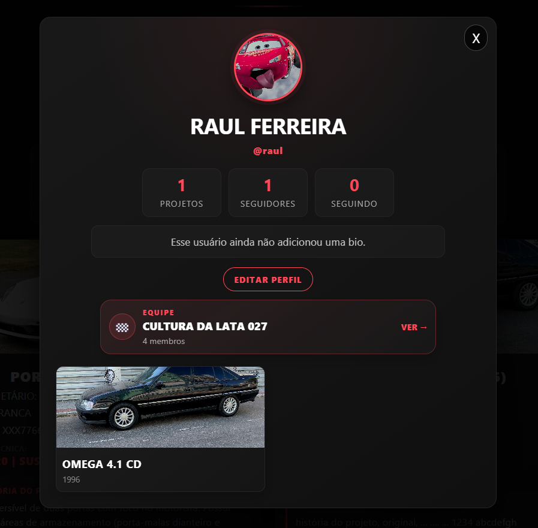

*Perfil público com avatar, nome, `@username`, bio, contadores sociais, equipe e projetos cadastrados pelo usuário.*

### Edição de Perfil

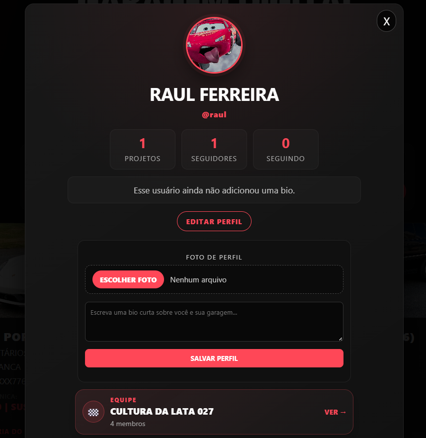

*Área de edição do próprio perfil com alteração de nome, bio e upload de avatar pelo dispositivo.*

### Menu do Usuário Logado

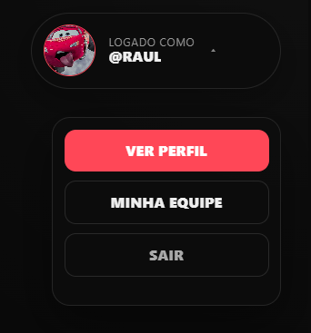

*Menu/dropdown do usuário logado com avatar, nome, `@username`, acesso ao perfil, área de equipe e opção de sair.*

### Minha Equipe

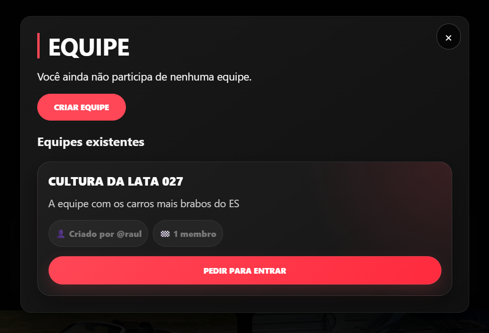

*Modal “Minha equipe” exibindo o estado do usuário sem equipe, botão para criar equipe e lista de equipes disponíveis.*

### Detalhe da Equipe

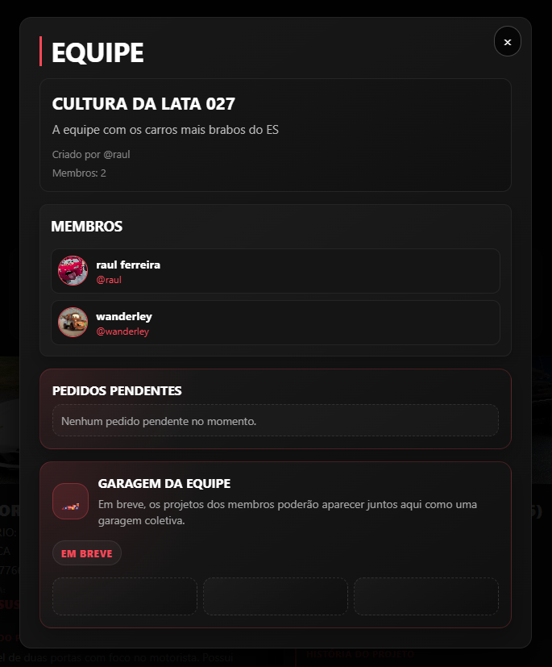

*Visualização detalhada de uma equipe com nome, descrição, criador, membros e espaço preparado para a futura garagem coletiva.*

### Pedidos de Entrada em Equipe

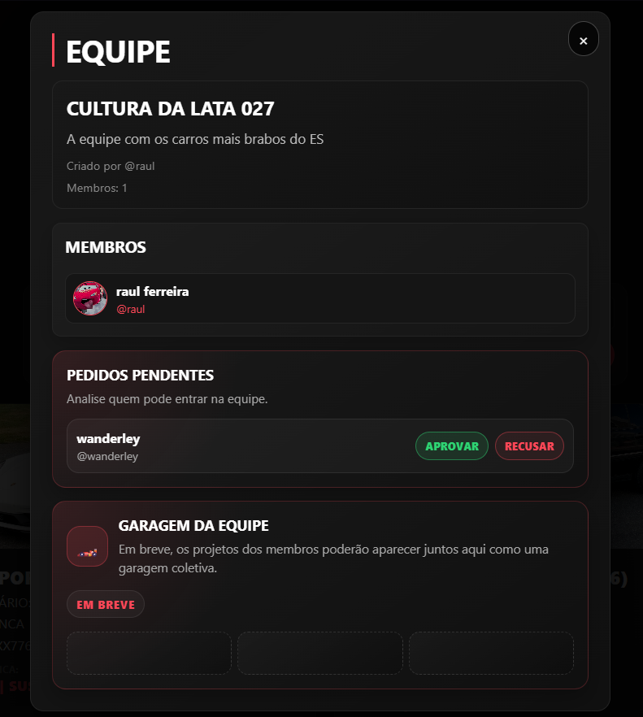

*Área de pedidos pendentes da equipe, permitindo ao criador aprovar ou recusar solicitações de entrada.*

### Feedback Visual Global

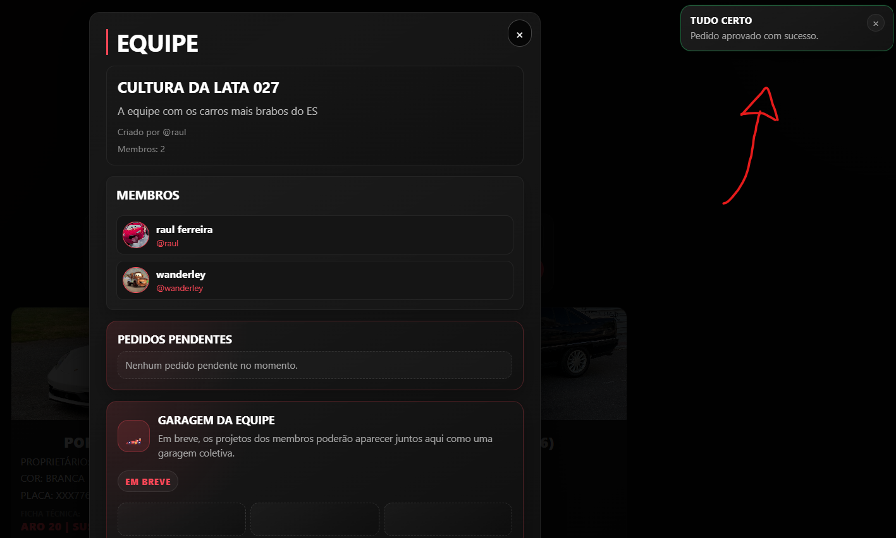

*Mensagem visual integrada à interface para ações de sucesso, erro ou aviso, substituindo gradualmente alertas simples do navegador.*

### Prévia Mobile

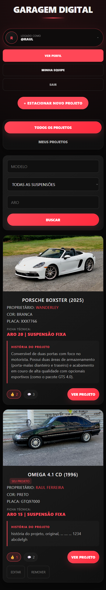

*Prévia da aplicação em tela menor, mostrando adaptação da interface para uso mobile, com layout responsivo e visual preservado.*

---

## 🔐 Segurança e Controle de Acesso

O projeto possui uma base inicial de autenticação e controle de permissões:

- Senhas são armazenadas com hash usando Werkzeug.
- Projetos são vinculados ao usuário que os cadastrou.
- Apenas o dono do projeto pode editar ou remover seus próprios veículos.
- Apenas o próprio usuário pode editar seu perfil, bio e avatar.
- Usuários não podem seguir a si mesmos.
- Curtidas duplicadas são impedidas no banco de dados.
- Comentários só podem ser removidos pelo próprio autor.
- Cada usuário pode participar de apenas uma equipe.
- Pedidos de entrada em equipe passam por aprovação do criador.
- A interface exibe ações de edição e exclusão apenas quando o usuário tem permissão.

Atualmente, a autenticação ainda é simples e baseada no estado mantido no front-end. Uma melhoria futura importante é adotar uma autenticação mais robusta com sessões Flask ou JWT, protegendo rotas sensíveis diretamente no back-end.

---

## 🧱 Estrutura Atual do Projeto

```text
garagem-digital/
├── app.py
├── index.html
├── style.css
├── script.js
├── garagem_digital.sql
├── README.md
├── .gitignore
├── uploads/
│   └── avatars/
└── screenshots/
    ├── 01-login-cadastro.png
    ├── 02-feed-geral.png
    ├── 03-cards-projetos.png
    ├── 04-modal-projeto.png
    ├── 05-comentarios.png
    ├── 06-perfil-usuario.png
    ├── 07-editar-perfil.png
    ├── 08-menu-usuario.png
    ├── 09-minha-equipe.png
    ├── 10-detalhe-equipe.png
    ├── 11-pedidos-equipe.png
    ├── 12-feedback-global.png
    └── 13-mobile-preview.png
```

> Observação: a pasta `uploads/` é usada localmente para armazenar imagens enviadas pelos usuários, mas os arquivos enviados não são versionados no GitHub.

---

## 🗄️ Banco de Dados

O banco de dados MySQL/MariaDB possui as principais tabelas:

- `usuarios`
- `carros`
- `curtidas`
- `comentarios`
- `seguidores`
- `clubes`
- `membros_clube`
- `pedidos_clube`

A tabela `usuarios` armazena dados de autenticação, perfil, avatar, bio e `username`.

A tabela `carros` armazena os projetos automotivos e possui vínculo com `usuarios`.

A tabela `curtidas` registra curtidas por usuário e projeto, impedindo duplicação.

A tabela `comentarios` registra comentários vinculados a usuários e projetos.

A tabela `seguidores` registra relações sociais entre usuários.

As tabelas `clubes`, `membros_clube` e `pedidos_clube` formam a base do sistema de equipes automotivas, permitindo criação de equipes, vínculo de membros e solicitações de entrada.

O arquivo `garagem_digital.sql` contém a estrutura atual do banco de dados e deve ser mantido atualizado sempre que houver mudanças estruturais.

---

## 🚀 Como Executar o Projeto

### 1. Clonar o repositório

```bash
git clone https://github.com/raullferreiraa/garagem-digital.git
cd garagem-digital
```

### 2. Criar e ativar ambiente virtual

```bash
python -m venv venv
```

No Windows:

```bash
venv\Scripts\activate
```

No Linux/Mac:

```bash
source venv/bin/activate
```

### 3. Instalar dependências

```bash
pip install flask flask-cors mysql-connector-python python-dotenv werkzeug
```

### 4. Configurar o banco de dados

Crie um banco MySQL/MariaDB e importe o arquivo:

```bash
mysql -u seu_usuario -p nome_do_banco < garagem_digital.sql
```

### 5. Configurar variáveis de ambiente

Crie um arquivo `.env` na raiz do projeto:

```env
DB_HOST=localhost
DB_USER=seu_usuario
DB_PASSWORD=sua_senha
DB_NAME=nome_do_banco
```

### 6. Rodar o back-end

```bash
python app.py
```

O back-end será iniciado em:

```text
http://127.0.0.1:5000
```

### 7. Abrir o front-end

Abra o arquivo `index.html` no navegador ou use uma extensão como Live Server.

---

## 🧪 Fluxo de Uso

1. Cadastre um usuário.
2. Faça login.
3. Cadastre um projeto automotivo.
4. Faça upload da imagem do projeto.
5. Veja o projeto no feed geral.
6. Use os filtros para buscar modelos, suspensão ou aro.
7. Curta e comente em projetos.
8. Abra o modal para ver a ficha técnica completa.
9. Acesse perfis clicando no nome de usuários.
10. Edite seu próprio perfil, avatar e bio.
11. Siga outros usuários.
12. Crie ou acesse uma equipe automotiva.
13. Peça para entrar em uma equipe.
14. Aprove ou recuse pedidos se você for o criador da equipe.

---

## 🧭 Roadmap

- [x] CRUD completo de projetos automotivos.
- [x] Upload de imagens dos projetos.
- [x] Validação de imagens enviadas.
- [x] Autenticação de usuários.
- [x] Hash de senha.
- [x] Área “Todos os projetos”.
- [x] Área “Meus projetos”.
- [x] Controle de edição e exclusão por dono.
- [x] Sistema de curtidas.
- [x] Sistema de comentários.
- [x] Modal detalhado do projeto.
- [x] Perfil de usuário.
- [x] Avatar e bio.
- [x] Username único.
- [x] Sistema de seguidores.
- [x] Menu de usuário logado.
- [x] Equipes automotivas.
- [x] Exibição da equipe no perfil.
- [x] Modal detalhado da equipe.
- [x] Pedidos de entrada em equipe.
- [x] Aprovação e recusa de pedidos.
- [x] Status visual de pedido pendente.
- [x] Feedback visual global.
- [x] Interface responsiva.
- [x] CSS separado em `style.css`.
- [x] JavaScript separado em `script.js`.
- [ ] Garagem coletiva da equipe.
- [ ] Sistema de convites para equipes.
- [ ] Cargos de equipe, como administrador ou moderador.
- [ ] Notificações internas.
- [ ] Feed social personalizado.
- [ ] Ranking de projetos mais curtidos.
- [ ] Página pública por projeto.
- [ ] Autenticação com sessões Flask ou JWT.
- [ ] Deploy online.
- [ ] Melhorias de acessibilidade.

---

## 📌 Observações de Desenvolvimento

O projeto segue um fluxo incremental:

- Uma issue por melhoria.
- Uma branch pequena por issue.
- Pull requests pequenas e testáveis.
- Merges somente depois de testar localmente.
- Alterações no banco sempre acompanhadas da atualização de `garagem_digital.sql`.

Esse fluxo ajuda a manter o projeto organizado e reduz o risco de quebrar funcionalidades já existentes.

---

## 👨‍💻 Autor

Desenvolvido por **Raul Ferreira**.

GitHub: [@raullferreiraa](https://github.com/raullferreiraa)

---

## 🏁 Conceito

A Garagem Digital busca valorizar a cultura automotiva de rua e os projetos reais construídos por entusiastas.

Mais do que um catálogo, a ideia é criar uma plataforma onde cada carro tenha identidade, história, evolução, comunidade e presença própria.
