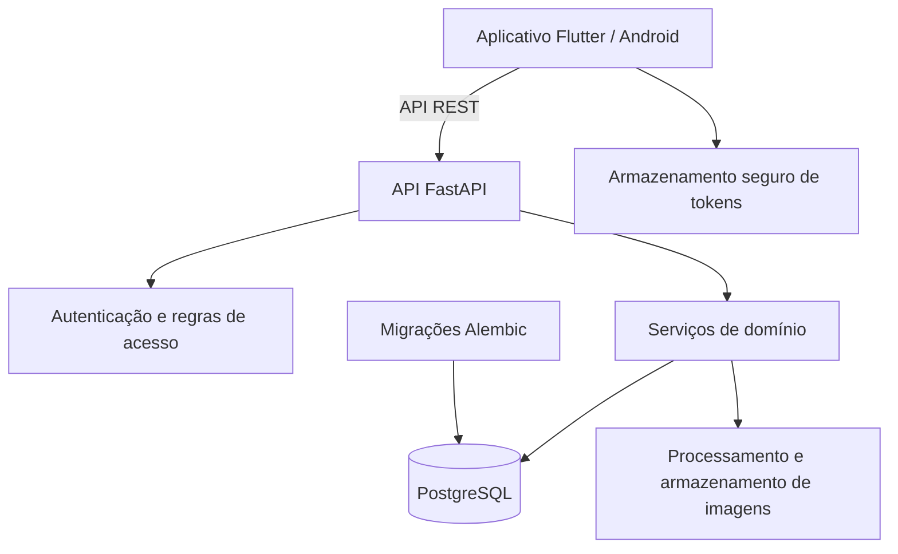

# GARONA

### Carros com história. Pessoas na mesma pista.

Aplicativo para documentar projetos automotivos, acompanhar sua evolução e conectar a comunidade.

**Flutter · FastAPI · PostgreSQL**

**Em desenvolvimento · Android · Código-fonte privado**

[O produto](#o-produto) · [Funcionalidades](#funcionalidades) · [Arquitetura](#arquitetura) · [Decisões técnicas](#decisões-técnicas) · [Qualidade](#qualidade-e-validação) · [Próximos passos](#próximos-passos) · [Autor](#autor)

---

## O produto

O **Garona** reúne a história do carro, o planejamento do projeto e as pessoas que acompanham essa trajetória. A proposta atende desde quem preserva um veículo original até quem restaura, modifica ou cuida de um carro de uso diário.

Um projeto automotivo se desenvolve ao longo do tempo: tem um ponto de partida, escolhas, etapas, manutenção e histórias. Fotos e atualizações publicadas em lugares diferentes dificultam consultar essa trajetória. O Garona organiza esses registros em uma garagem pessoal e permite compartilhá-los com a comunidade.

O aplicativo conecta três partes dessa experiência:

| Parte | O que a pessoa pode fazer |
| --- | --- |
| **Meu projeto** | Apresentar o carro, contar sua história, organizar fotos e planejar etapas. |
| **Sua evolução** | Registrar mudanças, manutenção e acontecimentos em um diário próprio. |
| **A comunidade** | Descobrir projetos, acompanhar pessoas, participar de equipes e consultar encontros. |

O projeto nasceu com o nome **Garagem Digital**, em uma primeira versão web. Hoje, o desenvolvimento está concentrado no aplicativo Garona e em sua API própria.

> Este repositório é a apresentação pública do produto e do trabalho de desenvolvimento. O código-fonte está em um repositório privado. O endereço original foi preservado para os links já compartilhados em currículos e portfólios.

## Funcionalidades

As funcionalidades abaixo fazem parte da versão principal de desenvolvimento. Isso não significa que o aplicativo já esteja disponível nas lojas.

### Garagem com identidade

Cada carro possui uma página própria, com informações que ajudam a apresentar o projeto e preservar sua história:

- Modelo, ano, cor e ficha do carro, com dados como motor, câmbio, combustível, potência, suspensão e rodas.
- Nome opcional do projeto, proposta e fase atual.
- História do carro, estado inicial, configuração original e modificações realizadas.
- Informação de aquisição com ano e mês opcional.
- Foto de capa e prévia da apresentação antes de salvar alterações.
- Proteção ao sair do formulário quando existem alterações não salvas.

O cadastro começa pelo essencial e permite completar as informações depois. Quando o projeto não tem um nome próprio, o modelo do carro é usado como título. Informações opcionais vazias não precisam ocupar espaço na apresentação.

### Galeria e etapas

A galeria apresenta o carro por diferentes ângulos e momentos. O proprietário pode publicar fotos com legenda, reorganizá-las e escolher uma imagem como capa. Quem visita o projeto pode consultar as fotos e ampliá-las, com navegação e zoom.

O planejamento do projeto fica em etapas agrupadas em **Planejadas**, **Em andamento** e **Concluídas**. Uma etapa concluída pode apontar para a evolução que registrou o resultado.

Essa relação preserva a diferença entre o planejamento e o diário: reabrir ou excluir uma etapa não apaga a evolução publicada.

### Diário de evoluções

As evoluções registram o que aconteceu com o projeto ao longo do tempo:

- Título, descrição, data, categoria e quilometragem, quando informada.
- Fotos relacionadas ao registro e consulta aos detalhes da evolução.
- Comentários, respostas e curtidas.
- Apresentação de registros com foto e de registros somente em texto.
- Histórico acessível na página do projeto.

O diário ajuda a acompanhar manutenção, mudanças e acontecimentos sem perder o vínculo com o carro correspondente.

### Descoberta e acompanhamento

A área de exploração permite encontrar projetos e acompanhar as pessoas por trás deles:

- Descoberta de projetos e pesquisa.
- Perfis públicos, seguidores e lista de pessoas seguidas.
- Projetos salvos para consultar depois.
- Feed de atualizações das pessoas acompanhadas.
- Compartilhamento de conteúdo pelo aplicativo.

No feed **Seguindo**, cada atualização representa uma evolução publicada. Quando existem fotos, o card utiliza imagens da própria evolução; quando não existem, apresenta o registro em texto. O cabeçalho mantém a identificação do projeto.

### Equipes

As equipes organizam a participação coletiva na comunidade:

- Perfil da equipe, apresentação e imagens próprias.
- Convites e solicitações de entrada.
- Cargos de dono, administrador, moderador e membro, com permissões específicas.
- Garagem coletiva com projetos escolhidos pelos integrantes.
- Conversa da equipe e acesso aos encontros relacionados.

Entrar em uma equipe não publica automaticamente todos os carros de uma pessoa na garagem coletiva. O integrante escolhe o projeto que vai representá-lo.

### Encontros

Os encontros são organizados como **comunidades com edições**. A comunidade conserva sua identidade e seus seguidores, enquanto cada edição representa uma data específica.

A base atual inclui:

- Organização por uma pessoa ou equipe autorizada.
- Comunidades públicas ou restritas à equipe.
- Capa, descrição, cidade e estado.
- Agendamento de edições com endereço e informações de data e horário.
- Confirmação de participação individual e da equipe.
- Consulta de pessoas e equipes participantes, com busca e paginação.
- Histórico de edições e cancelamento de uma data específica.
- Avisos internos sobre novas edições, alterações e cancelamentos.
- Integração com o calendário do aparelho.

O próximo ciclo aprofunda essa experiência com localização no mapa, participação com projeto e organização antes e depois do encontro. Esses avanços são detalhados em [Próximos passos](#próximos-passos).

### Conversas, conta e controles pessoais

A experiência também inclui conversas diretas, conversa da equipe, notificações internas e edição de perfil. A conta dispõe de alteração de senha, bloqueio de usuários e denúncia de perfis.

Esses recursos são tratados em conjunto com as regras de acesso e a separação entre informações públicas e dados da conta.

## Um fluxo de uso

1. **Apresentar o carro:** cadastrar o modelo e completar nome, proposta, história e ficha conforme necessário.
2. **Organizar o projeto:** publicar fotos, escrever legendas e criar as próximas etapas.
3. **Registrar um resultado:** publicar uma evolução e, se fizer sentido, vinculá-la à etapa concluída.
4. **Conectar-se:** descobrir projetos, acompanhar pessoas e participar de uma equipe.
5. **Encontrar a comunidade:** consultar as próximas edições dos encontros e seus participantes.

Esse fluxo orienta a organização das telas e a relação entre as funcionalidades.

## Experiência visual

A interface utiliza uma base escura em tons de verde, com acentos em verde-lima e tipografia que diferencia títulos, informações técnicas e textos narrativos. As fotos e a identidade dos projetos orientam a apresentação dos cards.

As decisões de interface incluem:

- Hierarquia entre nome do projeto, modelo, ano e informações complementares.
- História e ficha em seções expansíveis para facilitar a leitura.
- Controles de edição apresentados conforme a permissão da pessoa.
- Legenda disponível durante a publicação de fotos.
- Estados de carregamento, lista vazia e erro com possibilidade de tentar novamente.
- Verificação de telas estreitas e de texto ampliado nos fluxos cobertos pelos testes.

A interface vem sendo refinada por ciclos de revisão com capturas de tela e uso no emulador Android.

## Arquitetura

O aplicativo acessa uma API REST; as regras de negócio e as verificações de acesso são executadas no servidor. O banco não é acessado diretamente pelo cliente mobile.

```mermaid
flowchart TD
    A[Aplicativo Flutter / Android] -->|API REST| B[API FastAPI]
    A --> C[Armazenamento seguro de tokens]
    B --> D[Autenticação e regras de acesso]
    B --> E[Serviços de domínio]
    E --> F[(PostgreSQL)]
    E --> G[Processamento e armazenamento de imagens]
    H[Migrações Alembic] --> F
```

| Camada | Tecnologias e finalidade |
| --- | --- |
| **Aplicativo** | Flutter e Dart para telas, navegação, estado dos fluxos e integração com recursos do aparelho. |
| **Comunicação** | Dio para acesso à API e tratamento das requisições. |
| **API** | FastAPI e Pydantic para contratos HTTP e validação das entradas. |
| **Persistência** | SQLAlchemy e PostgreSQL para relacionamentos, consultas e transações. |
| **Migrações** | Alembic para evolução versionada do esquema. |
| **Autenticação** | JWT para acesso, tokens de renovação rotativos e hash de senhas com Argon2. |
| **Imagens** | Pillow para validar, orientar, redimensionar e normalizar uploads. |
| **Ambiente local** | Docker Compose para executar API e banco. |
| **Qualidade** | pytest, Flutter Test, análise estática e GitHub Actions. |

O ambiente de banco inclui PostGIS como base para a evolução dos recursos de localização. A seleção do local no mapa e a descoberta por proximidade ainda fazem parte do trabalho futuro.

Na implementação atual, as imagens são armazenadas em arquivos com persistência por volume no ambiente local. A implantação de produção ainda exige definir a infraestrutura de armazenamento, os backups e a operação do serviço.

## Decisões técnicas

### Separação entre projeto, planejamento e diário

O projeto concentra identidade e ficha. As etapas representam intenções e andamento. As evoluções documentam acontecimentos. Essa separação evita tratar a conclusão de uma tarefa como exclusão ou substituição do histórico do carro.

### Comunidade permanente, edições independentes

Um encontro recorrente pode manter uma comunidade única e realizar várias edições. As confirmações pertencem à edição correspondente. Cancelar uma data não equivale a excluir toda a comunidade.

### Permissões verificadas na API

A API verifica a propriedade do carro e os cargos de gestão das equipes antes de permitir alterações. Ocultar um botão na interface complementa essas verificações, mas a autorização é aplicada no servidor.

### Sessões de acesso e renovação

A autenticação utiliza token de acesso e token de renovação opaco, rotativo e revogável. O banco guarda o hash do token de renovação, e o aplicativo utiliza armazenamento seguro para os tokens da sessão.

### Evolução dos dados com compatibilidade

Mudanças no banco são registradas por migrações. Novos campos opcionais permitem que projetos anteriores continuem válidos e sejam completados aos poucos. O modelo continua servindo de título quando não há nome personalizado.

### Consultas e carregamento gradual

O catálogo de projetos utiliza paginação por cursor, enquanto a consulta de participantes dos encontros tem busca e paginação próprias. Os recursos são carregados conforme os fluxos de uso, com tratamento para falhas e novas tentativas.

### Processamento de imagens

Os uploads passam por validação de tamanho e conteúdo. O processamento considera a orientação da imagem, reduz dimensões e normaliza o arquivo. Capas e fotos da galeria são mantidas de forma independente para que a remoção de uma foto não elimine automaticamente a capa escolhida.

## Privacidade e controles de acesso

O produto já possui regras concretas para a exposição de informações e as ações dos usuários:

- O e-mail da conta não integra o perfil público.
- A exibição pública da placa depende de uma escolha explícita do proprietário.
- Edição e exclusão de projetos exigem vínculo com o proprietário.
- Ações de gestão das equipes dependem do cargo do integrante.
- Comunidades restritas têm acesso condicionado à equipe.
- Bloqueio de usuários e denúncia de perfis fazem parte dos controles pessoais.

Essas regras fazem parte da implementação e dos cenários de teste. A preparação para produção inclui revisar continuamente segurança, privacidade e operação.

## Qualidade e validação

O desenvolvimento combina testes automatizados com revisão dos fluxos e da interface.

| Verificação | O que é avaliado |
| --- | --- |
| **Testes de backend** | Autenticação, permissões, regras de negócio, persistência e respostas da API. |
| **Testes Flutter** | Comportamento de telas, formulários, navegação e integração com respostas simuladas da API. |
| **Análise estática** | Problemas identificados pelo analisador de Dart e Flutter. |
| **Migrações em CI** | Aplicação do esquema no PostgreSQL antes dos testes do backend. |
| **Compilação em CI** | Geração de APK de depuração para verificar a integração do aplicativo Android. |
| **Revisão manual** | Uso no emulador, fotos em diferentes proporções e avaliação das telas por capturas. |

Entre os cenários cobertos estão alterações não salvas, diferenças entre acesso do dono e do visitante, galerias com legendas, vínculo entre etapa e evolução, filtragem de encontros, respostas de erro e telas com fonte ampliada.

As verificações dão suporte às mudanças durante o desenvolvimento. A validação de publicação e da infraestrutura de produção permanece como uma etapa própria.

## Evolução do projeto

| Etapa | Resultado |
| --- | --- |
| **Primeira versão web — Garagem Digital** | Aplicação com Flask, MySQL/MariaDB, HTML, CSS e JavaScript para projetos, perfis e interação social. |
| **Transição para mobile — Garona** | Aplicativo Flutter Android e API FastAPI com PostgreSQL, mantendo a versão web anterior como referência histórica. |
| **Identidade da garagem** | Nome e proposta do projeto, história, aquisição, galeria com legendas, etapas e integração com o diário de evoluções. |
| **Comunidade e encontros — em andamento** | Evolução das edições, participação e organização dos encontros, com funcionalidades adicionais planejadas. |

A passagem da versão web para mobile envolveu uma nova API e um novo banco. Os ambientes das duas versões são independentes; não existe sincronização automática entre eles.

## Próximos passos

O ciclo atual está focado em completar a experiência dos encontros: descobrir uma edição, combinar a participação, chegar ao local e registrar o que aconteceu.

**Em implementação:**

- Navegação e participação por edição específica.
- Estados de edição iniciada, em andamento e encerrada.
- Término opcional e encerramento manual pela organização.
- Interesse na edição e confirmação com um projeto da garagem ou sem carro.
- Reaproveitamento das informações de uma edição para organizar outra data.

**Planejado para o mesmo ciclo:**

- Agenda com filtros por período e paginação no servidor.
- Busca do local no mapa, ajuste do ponto de chegada e abertura de rota.
- Consulta aos projetos confirmados para uma edição.
- Convites individuais e coordenação da saída da equipe.
- Comunicados da organização e notificações que abrem a edição correta.
- Lembretes opcionais e álbum coletivo da edição.
- Vínculo entre um encontro e evoluções já publicadas pelos participantes.

A publicação nas lojas, a operação do backend em produção e a configuração e validação para iOS também são etapas futuras. Os itens desta seção descrevem a direção do desenvolvimento e não representam recursos já publicados.

## O que este projeto demonstra

O desenvolvimento do Garona reúne trabalho de produto e engenharia em uma aplicação integrada:

- Modelagem de domínio e de relacionamentos entre usuários, projetos, equipes, etapas, evoluções e edições.
- Construção de uma API com validação, autenticação, transações e permissões.
- Implementação de fluxos mobile conectados à API e aos recursos do aparelho.
- Evolução do banco com migrações e preservação de dados existentes.
- Tratamento de uploads e organização de conteúdo visual.
- Uso de testes, integração contínua e validação manual para revisar mudanças.
- Refinamento de interface com base em uso, capturas de tela e problemas identificados nos fluxos.

## Disponibilidade e código-fonte

O Garona está em desenvolvimento, com validação concentrada no Android. Ainda não há uma versão publicada nas lojas nem uma demonstração pública hospedada.

Este repositório contém a apresentação do produto. O código-fonte é privado e não é distribuído sob uma licença de código aberto. Por isso, esta página não oferece instruções de instalação do aplicativo a partir do código nem links para o repositório de desenvolvimento.

Para conversar sobre o projeto, sua arquitetura ou uma avaliação técnica, utilize os meios de contato disponíveis no [perfil do autor no GitHub](https://github.com/raullferreiraa).

## Autor

**Raul Ferreira** — concepção e desenvolvimento do Garona.

[Conheça meu perfil no GitHub](https://github.com/raullferreiraa)

---

**Garona · Carros com história. Pessoas na mesma pista.**

© 2026 Raul Ferreira. Apresentação pública do projeto.

