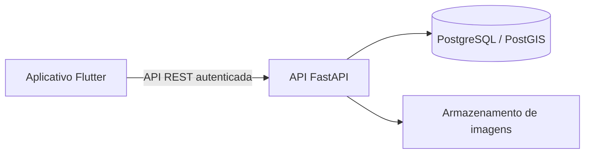

# Garona

**Carros com história. Pessoas na mesma pista.**

O Garona é um aplicativo em desenvolvimento para registrar projetos automotivos, acompanhar sua evolução e conectar pessoas por meio de equipes e encontros.

O projeto começou como **Garagem Digital**, uma aplicação web, e evoluiu para um aplicativo mobile com API própria. Este repositório apresenta o produto e as decisões técnicas para fins de portfólio. O código-fonte do aplicativo segue em um repositório privado.

## A experiência

- **Garagem pessoal:** identidade do projeto, história, ficha do carro, galeria com legendas e etapas planejadas.
- **Diário de evoluções:** registros com textos e fotos, acompanhados por comentários e curtidas.
- **Comunidade:** perfis, seguidores, descoberta de projetos e atualizações de quem você acompanha.
- **Equipes:** garagem coletiva, convites, solicitações de entrada, cargos de gestão e conversa entre integrantes.
- **Encontros:** comunidades com edições independentes, participantes, organização por usuário ou equipe e integração com calendário.
- **Comunicação:** conversas, notificações e compartilhamento de conteúdo.

## Estado atual

O aplicativo está em desenvolvimento e foi validado principalmente em Android. Ainda não está publicado nas lojas. Recursos novos passam por testes automatizados e validação da interface antes de entrar na versão principal.

A evolução atual concentra-se na organização de encontros e na participação da comunidade.

## Arquitetura

```mermaid
flowchart LR
    A[Aplicativo Flutter] -->|API REST autenticada| B[API FastAPI]
    B --> C[(PostgreSQL / PostGIS)]
    B --> D[Armazenamento de imagens]
```

| Camada | Tecnologias |
| --- | --- |
| Aplicativo | Flutter, Dart, Material, Dio |
| API | Python, FastAPI, Pydantic, SQLAlchemy |
| Banco e migrações | PostgreSQL, PostGIS, Alembic |
| Autenticação | JWT, sessões de renovação e hash de senhas com Argon2 |
| Desenvolvimento local | Docker Compose |
| Qualidade | pytest, Flutter Test, análise estática e GitHub Actions |

## Decisões de desenvolvimento

**Identidade do projeto.** O carro pode ter um nome próprio, uma proposta e uma história. A apresentação usa o modelo como alternativa quando não existe um nome personalizado.

**Planejamento e memória.** Etapas descrevem o que será feito; evoluções registram o que aconteceu. A conclusão de uma etapa pode levar ao registro correspondente no diário.

**Comunidades e edições.** Um encontro pode ter várias datas. Cada edição mantém suas confirmações e seu histórico, enquanto a comunidade conserva sua identidade e seus seguidores.

**Permissões no servidor.** A API verifica propriedade dos projetos, cargos nas equipes e acesso a conteúdo restrito. As opções da interface refletem essas regras.

**Evolução gradual.** O aplicativo substituiu a primeira versão web, que utilizava Flask e MySQL. O desenvolvimento atual utiliza uma API FastAPI e PostgreSQL.

## Sobre o código

O Garona está sendo desenvolvido como um produto com código-fonte privado. Este repositório público contém somente sua apresentação; não inclui o código do aplicativo, credenciais ou dados operacionais.

Para conversar sobre o projeto ou sobre uma avaliação técnica, entre em contato pelo [perfil do autor no GitHub](https://github.com/raullferreiraa).

## Autor

Concepção e desenvolvimento por **Raul Ferreira**.

[Perfil no GitHub](https://github.com/raullferreiraa)

---

© 2026 Raul Ferreira. Conteúdo de apresentação do Garona.
